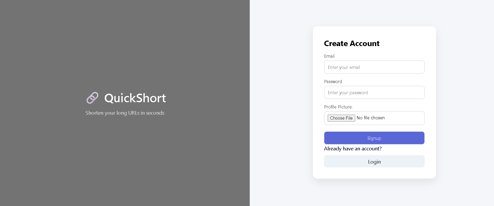
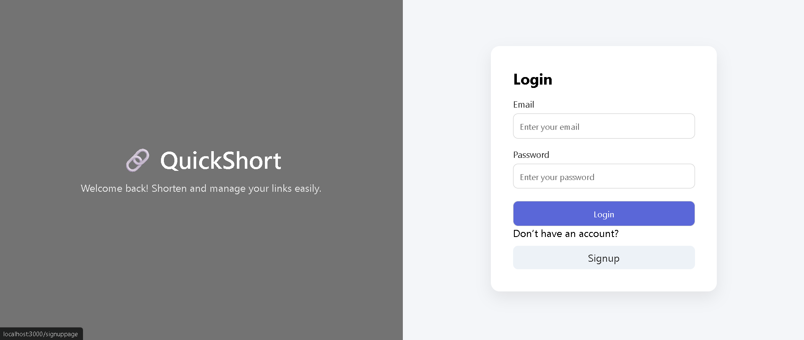
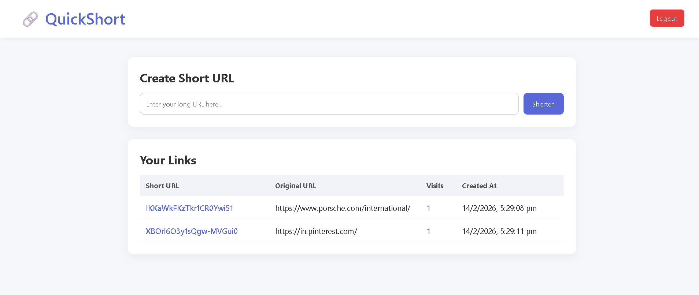

# 🔗 URL Shortener (Node.js + Express + MongoDB)

**Features**

- JWT Authentication
- Authorization (owner-based delete)
- MVC Architecture
- Visit Tracking
- URL Shortening

**Tech Stack**
- Node.js
- Express.js
- MongoDB + Mongoose
- EJS
- JWT Authentication
- Bcrypt

**Screenshots section**

## 📸 Screenshots

### 🔐 Signup Page

### 🔑 Login Page

### 🏠 Dashboard

**How to run locally**

git clone <your-repo-link>
cd url-shortener
npm install
npm start